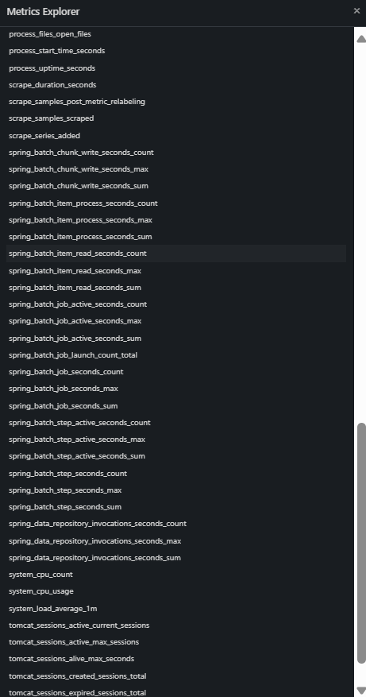

# Mutual Insurance File Management System with Spring Batch

This project is a **Spring Batch** application for managing mutual insurance claim records. The system automates file processing, validates data, calculates reimbursement amounts based on reference drug data, and archives the results into a PostgreSQL database. It includes comprehensive monitoring through **Prometheus** for metrics collection and **Zipkin** for distributed tracing.

---

## Table of Contents

1. [Project Context](#project-context)
2. [Objective](#objective)
3. [Features](#features)
4. [Monitoring & Observability](#monitoring--observability)
5. [Folder Structure](#folder-structure)
6. [How It Works](#how-it-works)
7. [Setup and Run](#setup-and-run)
8. [Docker Integration](#docker-integration)

---

## Project Context

In mutual insurance systems, claims often include consultations and medical treatments. Managing these files involves validating data, calculating reimbursements, and archiving processed information. This project leverages **Spring Batch** to automate and streamline these tasks while ensuring compliance with reimbursement policies.

---

## Objective

This application automates the following processes:

1. **Reading Files**: Extract insurance data from JSON files.
2. **Data Validation**: Verify essential details for each claim.
3. **Reimbursement Calculation**: Calculate total reimbursement using reference drug prices and fixed consultation percentages.
4. **Data Archiving**: Store processed claims in a PostgreSQL database or output files.
5. **Performance Monitoring**: Track application metrics and trace requests across services.

---

## Features

### File Reading
- **Input Format**: JSON files containing:
    - **Insured**: Name, affiliation number, registration ID.
    - **Beneficiary**: Name, relationship to insured, filing date.
    - **Consultation**: Total cost, consultation price, number of attachments.
    - **Treatments**: Details for each treatment (barcode, name, type, price, availability).

### Reference Drug Data
- A database of reference drugs with:
    - Drug name.
    - Reference price.
    - Reimbursement percentage.

### Data Validation
- Insured name and affiliation number must be non-empty.
- Consultation price and total cost must be positive.
- Treatment list must not be empty.

### Reimbursement Calculation
- **Consultation**: Fixed reimbursement percentage applied to consultation cost.
- **Treatments**: Reimbursements based on reference prices and percentages.

### Processor Chaining
- Combines multiple processors for validation and calculation:
    1. **ValidationProcessor**: Ensures data integrity.
    2. **CalculationProcessor**: Calculates reimbursement amounts.

### Data Archiving
- Stores processed data with total reimbursement amounts in:
    - PostgreSQL database (primary storage).
    - CSV/Excel files for backup.

---

## Monitoring & Observability

The application integrates comprehensive monitoring and observability tools to track performance, detect issues, and trace requests across the system.

### Zipkin - Distributed Tracing

**Zipkin** is integrated to provide distributed tracing capabilities, allowing you to visualize request flows and identify performance bottlenecks.


**Key Features:**
- Trace HTTP requests from `/start-batch` endpoint
- Monitor batch job execution spans
- Visualize request durations and dependencies
- Track database interactions and external service calls
- Identify slow operations with timing breakdowns

**Access Zipkin:**
- URL: `http://localhost:9411`
- View recent traces, search by trace ID, or filter by service name
- Analyze timing data to optimize batch processing performance

### Prometheus - Metrics Collection

**Prometheus** collects and stores time-series metrics from the application, enabling real-time monitoring of system health and performance.


**Available Metrics:**
- **Spring Batch Metrics:**
    - `spring_batch_chunk_write_seconds_count` - Number of chunk writes
    - `spring_batch_item_process_seconds_sum` - Total item processing time
    - `spring_batch_item_read_seconds_count` - Number of items read
    - `spring_batch_job_active_seconds_count` - Active job execution time
    - `spring_batch_job_seconds_max` - Maximum job execution duration
    - `spring_batch_step_seconds_count` - Step execution counts

- **System Metrics:**
    - `system_cpu_usage` - CPU utilization
    - `system_load_average_1m` - System load average
    - `process_uptime_seconds` - Application uptime
    - `jvm_memory_used_bytes` - JVM memory usage



**Access Prometheus:**
- URL: `http://localhost:9090`
- Query metrics using PromQL
- Create custom dashboards
- Set up alerts for critical thresholds

---

## Folder Structure

```
mutual-claim-management
├── batch/
│   ├── config/
│   │   ├── FlatFileItemReaderConfig.java
│   │   └── ReimbursementJobConfig.java
│   ├── processor/
│   │   ├── ValidationProcessor.java
│   │   ├── ConsultationProcessor.java
│   │   ├── TreatmentMappingProcessor.java
│   │   ├── TreatmentReimbursementProcessor.java
│   │   └── TotalReimbursementProcessor.java
│   ├── reader/
│   │   ├── JsonItemReader.java
│   │   └── CsvItemReader.java
│   └── writer/
│       ├── CsvItemWriter.java
│       └── DossierDatabaseWriter.java
├── config/
│   └── prometheus.yml
├── controller/
│   └── BatchController.java
├── dto/
│   ├── DossierDTO.java
│   └── TreatmentDTO.java
├── images/
│   ├── img.png (Zipkin traces)
│   ├── img_1.png (Prometheus graphs)
│   └── img_2.png (Metrics explorer)
├── model/
│   ├── Dossier.java
│   ├── Treatment.java
│   └── TreatmentProduct.java
├── repository/
│   ├── DossierRepository.java
│   └── MedicationReferenceRepository.java
├── scheduler/
│   └── JobTrigger.java
├── service/
│   ├── DossiersContext.java
│   ├── DossierService.java
│   ├── ReferenceMedicationService.java
│   └── ReimbursementService.java
├── resources/
│   ├── application.properties
│   ├── ref.csv
│   ├── schema-postgresql.sql
├── test/
└── docker-compose.yml
```

---

## How It Works

1. **File Reading**:
    - JSON data is parsed using `JsonItemReader`.
    - Each claim is represented as a `Dossier` object.

2. **Validation**:
    - Ensures required fields are present and valid.

3. **Reimbursement Calculation**:
    - **ConsultationProcessor**: Applies a fixed percentage to consultation costs.
    - **TreatmentMappingProcessor**: Maps treatments to reference drugs.
    - **TreatmentReimbursementProcessor**: Calculates reimbursement for each treatment.
    - **TotalReimbursementProcessor**: Summarizes total reimbursements.

4. **Data Writing**:
    - Stores processed data into a PostgreSQL database via `DossierDatabaseWriter`.

5. **Monitoring**:
    - Zipkin captures distributed traces for each batch job execution.
    - Prometheus collects metrics on job performance, system resources, and processing rates.

---

## Setup and Run

### Prerequisites
- **Java 17** or later.
- **Maven** for building the project.
- **Docker** and **Docker Compose** for containerized deployment.

### Steps
1. Clone the repository:
   ```bash
   git clone https://github.com/yourusername/mutual-claim-management.git
   cd mutual-claim-management
   ```

2. Build the application:
   ```bash
   mvn clean install
   ```

3. Start all services with Docker Compose:
   ```bash
   docker-compose up -d
   ```
   This will start:
    - PostgreSQL database (port 5432)
    - Application server (port 8080)
    - Zipkin tracing server (port 9411)
    - Prometheus metrics server (port 9090)

4. Verify services are running:
   ```bash
   docker-compose ps
   ```

5. Access the application and monitoring tools:
    - **Application API**: `http://localhost:8080/api/start-batch`
    - **Zipkin Dashboard**: `http://localhost:9411`
    - **Prometheus Dashboard**: `http://localhost:9090`

6. Trigger a batch job:
   ```bash
   curl -X POST http://localhost:8080/api/start-batch
   ```

7. Monitor the execution:
    - View traces in Zipkin to see the request flow
    - Check Prometheus metrics for performance data

---

## Docker Integration

The `docker-compose.yml` file orchestrates multiple services for a complete development and monitoring environment.

### Service Configuration

```yaml
services:
  # Application server
  server:
    hostname: Mutual_Insurance_File_Management_Sys
    build:
      context: .
    ports:
      - "8080:8080"
    depends_on:
      - postgres
      - zipkin

  # PostgreSQL database
  postgres:
    hostname: postgres
    image: postgres
    restart: always
    environment:
      POSTGRES_USER: postgres
      POSTGRES_PASSWORD: password
      POSTGRES_DB: reimbursement_db
    volumes:
      - ./src/main/resources/schema-postgresql.sql:/docker-entrypoint-initdb.d/schema.sql
    ports:
      - "5432:5432"
    healthcheck:
      test: ["CMD", "pg_isready", "-U", "postgres"]
      interval: 10s
      timeout: 5s
      retries: 5

  # Zipkin distributed tracing
  zipkin:
    hostname: zipkin
    image: openzipkin/zipkin:latest
    ports:
      - "9411:9411"
    healthcheck:
      test: ["CMD", "wget", "--spider", "http://localhost:9411/health"]
      interval: 10s
      timeout: 5s
      retries: 5

  # Prometheus metrics collection
  prometheus:
    hostname: prometheus
    image: prom/prometheus:latest
    ports:
      - "9090:9090"
    volumes:
      - ./config/prometheus.yml:/etc/prometheus/prometheus.yml
    healthcheck:
      test: ["CMD", "wget", "--spider", "http://localhost:9090/-/healthy"]
      interval: 10s
      timeout: 5s
      retries: 5
```

### Prometheus Configuration

Create `config/prometheus.yml` to configure metrics scraping:

```yaml
global:
  scrape_interval: 15s
  evaluation_interval: 15s

scrape_configs:
  - job_name: 'spring-batch-app'
    metrics_path: '/actuator/prometheus'
    static_configs:
      - targets: ['server:8080']
```

### Application Properties

Ensure your `application.properties` includes:

```properties
# Actuator endpoints for Prometheus
management.endpoints.web.exposure.include=health,prometheus,metrics
management.endpoint.prometheus.enabled=true
management.metrics.export.prometheus.enabled=true

# Zipkin tracing configuration
management.tracing.sampling.probability=1.0
management.zipkin.tracing.endpoint=http://zipkin:9411/api/v2/spans
```

---

## Monitoring Best Practices

1. **Use Zipkin to debug issues**: When batch jobs fail or perform slowly, check Zipkin traces to identify bottlenecks.

2. **Set up Prometheus alerts**: Configure alerts for critical metrics like job failures, high memory usage, or slow processing rates.

3. **Monitor trends over time**: Use Prometheus graphs to identify performance degradation patterns.

4. **Combine metrics and traces**: Use both tools together - Prometheus shows "what" is happening, Zipkin shows "why" it's happening.

## Contributing

Contributions are welcome! Please submit pull requests or open issues for bugs and feature requests.